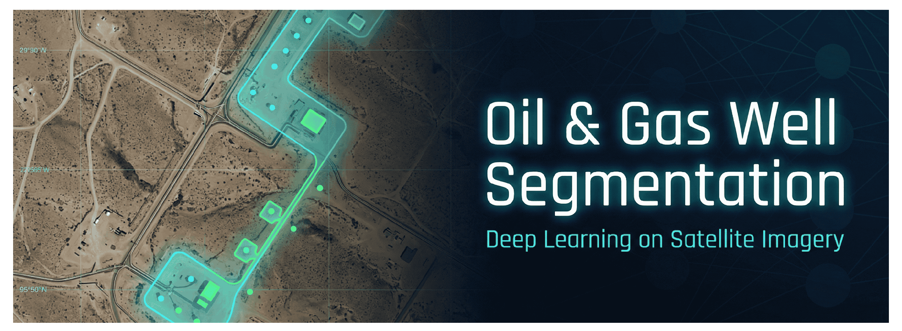

[](https://github.com/liturriago/oil-gas-well-segmentation/actions/workflows/ci.yaml)



# Segmentación de Pozos de Petróleo y Gas — Imágenes Satelitales Multiespectrales

> **Segmentación binaria de pozos de petróleo/gas a partir de imágenes satelitales de 4 canales (RGB + NIR) utilizando ResUNet con PyTorch DDP puro.**

---

## Características

| Capacidad | Implementación |
|---|---|
| Arquitectura | ResUNet (Codificador ResNet-{18,34,50}, preentrenado en ImageNet) |
| Entrada | 4 canales RGB + NIR, adaptable a cualquier resolución |
| Función de Pérdida | Focal Loss (`torchvision.ops`) + Dice Loss (personalizada) |
| Métricas | Dice Score, Sensibilidad, Especificidad — por clase + macro |
| Distribuido | `torch.nn.parallel.DistributedDataParallel` vía `torchrun` |
| Precisión Mixta | `torch.cuda.amp.autocast` + `GradScaler` |
| Configuración | Hydra + Pydantic v2 para validación |
| Formato de Datos | WebDataset (fragmentos `.bin` / `.tar`, claves `.npy`) |
| Aumentos | albumentations (transformaciones emparejadas imagen+máscara) |

---

## Inicio Rápido

### 1. Instalación

```bash
pip install -e ".[dev]"
```

### 2. Preparar los Datos

Los datos deben ser fragmentos (shards) de WebDataset (`.bin` o `.tar`) donde cada muestra contenga:

```
sample.image.npy   → float32 / uint16  (H, W, 4)  — canales RGB + NIR al final
sample.mask.npy    → uint8 / int32     (H, W)      — etiquetas binarias {0, 1}
```

Actualiza las rutas en `configs/config.yaml`:

```yaml
data:
  train_path: data/train.bin
  val_path:   data/val.bin
```

### 3. Entrenamiento en una sola GPU

```bash
python train.py
```

### 4. Entrenamiento Multi-GPU (DDP)

```bash
torchrun --nproc_per_node=2 train.py
```

### 5. Sobrescribir la Configuración sobre la marcha (Hydra)

```bash
python train.py training.lr=5e-4 training.epochs=100 model.encoder=resnet50
```

### 6. Ejecutar la Aplicación Web

Para probar el modelo de forma interactiva y visualizar los resultados de la segmentación, puedes ejecutar la aplicación web de Streamlit:

```bash
streamlit run app.py
```

La aplicación ofrece dos modos:
- **Cargar Base de Datos de Prueba**: Explora el conjunto de validación `val.bin` para buscar y visualizar predicciones.
- **Subir Imagen**: Sube tus propias imágenes `.tif` para probar el modelo. Soporta tanto imágenes de 16-bits con 4 canales (RGB + NIR) como imágenes estándar RGB de 8-bits.

*Nota: Puedes generar imágenes de prueba a partir del conjunto de validación usando los scripts provistos `export_tiff.py` y `export_best.py`.*

---

## Referencia de Configuración

Edita `configs/config.yaml` para controlar cada aspecto del entrenamiento:

```yaml
training:
  lr: 1.0e-3        # Tasa de aprendizaje máxima
  batch_size: 8     # Tamaño de lote por GPU
  epochs: 50
  optimizer: adam   # adam | adamw | sgd
  scheduler: cosine # cosine | step | none
  use_amp: true     # Precisión mixta (AMP)
  use_ddp: true     # Entrenamiento distribuido
  num_gpus: 2
  grad_clip: 1.0    # Norma máxima del gradiente (0 = desactivado)
  warmup_epochs: 5  # Épocas de calentamiento lineal

model:
  in_channels: 4    # RGB + NIR
  out_channels: 1   # Segmentación binaria
  encoder: resnet34 # resnet18 | resnet34 | resnet50

loss:
  focal_alpha: 0.75
  focal_gamma: 2.0
  dice_weight: 1.0
  focal_weight: 1.0

data:
  image_size: 256
  augmentation: true
  mean: [0.485, 0.456, 0.406, 0.35]  # Por canal (NO el global de ImageNet)
  std:  [0.229, 0.224, 0.225, 0.15]

metrics:
  threshold: 0.5   # Umbral de Sigmoide para la binarización

system:
  seed: 42
  num_workers: 4
  checkpoint_dir: checkpoints
```

---

## Métricas

Todas las métricas han sido implementadas desde cero (sin `torchmetrics`).

| Métrica | Fórmula | Clase |
|---|---|---|
| **Dice Score** | 2·TP / (2·TP + FP + FN) | por clase + macro |
| **Sensibilidad** | TP / (TP + FN) | por clase + macro |
| **Especificidad** | TN / (TN + FP) | por clase + macro |

## Reporte de Rendimiento del Modelo

Tras el entrenamiento y evaluación sobre el conjunto de validación, el modelo ResUNet ha demostrado un desempeño robusto en la compleja tarea de segmentación de pozos de petróleo y gas. 

Dada la naturaleza altamente desbalanceada del problema (donde más del 99% de los píxeles corresponden al fondo y una fracción mínima a la infraestructura petrolera), las métricas se analizan de manera desglosada por clase para obtener una visión realista del rendimiento de la red neuronal.

### Resultados Cuantitativos

Los resultados finales obtenidos con los pesos del mejor punto de control (`best.pt`) son los siguientes:

| Métrica | Promedio Macro | Clase 0 (Fondo/Terreno) | Clase 1 (Pozos) |
|---|:---:|:---:|:---:|
| **Coeficiente Dice** | 0.7373 | 0.9982 | 0.4764 |
| **Sensibilidad** | 0.7311 | 0.9983 | 0.4640 |
| **Especificidad** | 0.7311 | 0.4640 | 0.9983 |

*Nota: La función de pérdida durante la evaluación alcanzó un valor de **0.0022**.*

### Análisis de Resultados

1. **Precisión en la Detección del Terreno (Clase 0):** El modelo exhibe una capacidad casi perfecta para identificar el fondo, logrando un Coeficiente Dice de **0.9982**. Esto asegura que las vastas extensiones de bosque y terreno no modificado no generen ruido visual en la predicción final.
2. **Segmentación de Infraestructura (Clase 1):** Alcanzar un Dice de **0.4764** en la clase minoritaria es un resultado significativo y altamente funcional. En tareas de teledetección de objetos extremadamente pequeños (pozos en una escala kilométrica), un Dice superior a 0.45 indica que el modelo logra localizar exitosamente la infraestructura, superponiéndose de manera sustancial con los polígonos reales. 
3. **Control de Falsos Positivos:** La altísima especificidad de la clase 1 (**0.9983**) confirma que la tasa de falsos positivos (alarmas falsas) es excepcionalmente baja. En un contexto operativo, esto significa que cuando el modelo emite una alerta sobre la presencia de un pozo, es sumamente probable que la infraestructura realmente exista en las coordenadas señaladas.

Estos resultados validan la elección de la arquitectura ResUNet y la inclusión analítica del canal infrarrojo cercano (NIR), demostrando ser una herramienta sumamente eficaz para la monitorización de hidrocarburos a gran escala.

---

## Checkpoints (Puntos de control)

Los pesos del modelo (checkpoints) se guardan en la carpeta `checkpoints/` (configurable):

| Archivo | Descripción |
|---|---|
| `best.pt` | Mejor modelo basado en el **Dice de primer plano (foreground)** |
| `last.pt` | Época más reciente |

Cargar un checkpoint:

```python
from src.utils.checkpoint import load_checkpoint
from src.models.resunet import ResUNet

model = ResUNet(in_channels=4, out_channels=1)
ckpt = load_checkpoint("checkpoints/best.pt", model)
print(f"Época cargada: {ckpt['epoch']}")
```

---

## Ejecutar Pruebas

```bash
pytest                       # todas las pruebas
pytest tests/test_metrics.py # archivo específico
pytest -v --tb=short         # modo detallado (verbose)
```

---

## Arquitectura del Modelo

```
Entrada (N, 4, H, W)
       │
   [Codificador — ResNet34]
   └── s0: (N,  64, H/2,  W/2)   stem
   └── s1: (N,  64, H/4,  W/4)   layer1
   └── s2: (N, 128, H/8,  W/8)   layer2
   └── s3: (N, 256, H/16, W/16)  layer3
   └──  b: (N, 512, H/32, W/32)  bottleneck (layer4)
       │
   [Decodificador — Bilinear Upsample + Bloques Residuales]
   └── d3: (N, 256, H/16, W/16)  + skip s3
   └── d2: (N, 128, H/8,  W/8)   + skip s2
   └── d1: (N,  64, H/4,  W/4)   + skip s1
   └── d0: (N,  32, H/2,  W/2)   + skip s0
       │
   [Cabecera (Head)]
   └── out: (N, 1, H, W) — logits en bruto (sin sigmoide)
```

Los pesos del canal NIR se inicializan a partir del promedio de los pesos de los 3 canales RGB preentrenados, para conservar los beneficios del preentrenamiento en ImageNet.

---

## Licencia

MIT
